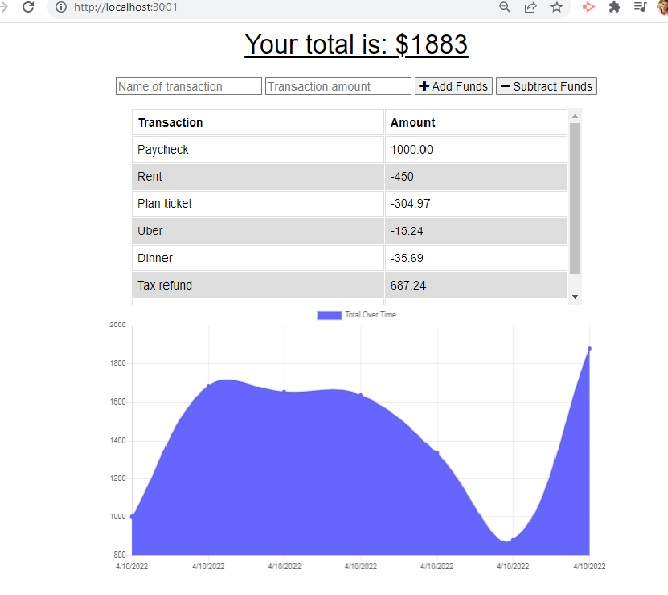

# PWA Budget Tracker

## Description
This application is a budget tracking Progressive Web Application (PWA).  It allows users to add expenses and deposits to their budget with or without an internet connection. When the user enters transactions offline, the total is updated when they're brought back online.

## Installation
Use the command 'npm install' to install the necessary dependencies and to be able to use the application. Use the command 'npm start' to connect to the host server.

## Deployment
Please use the following link to access the deployed application on Heroku.

## Screenshot
Below is a screenshot of the application.

## Collaborators
Beyond the started code given, all code was written by Sara Barnett.